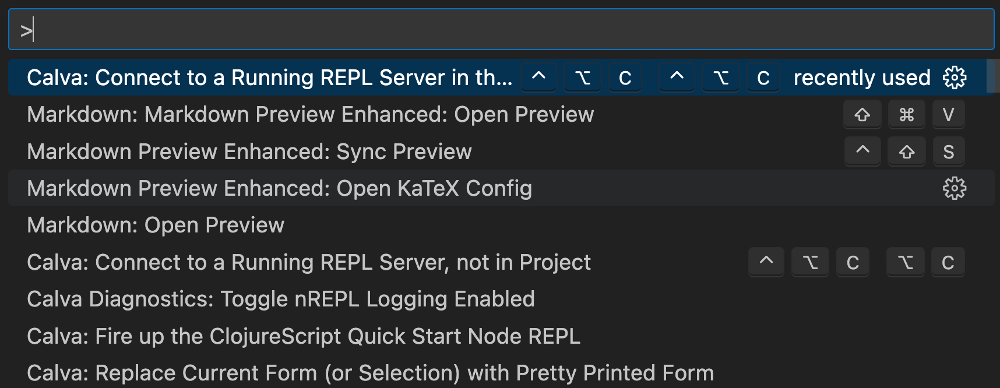
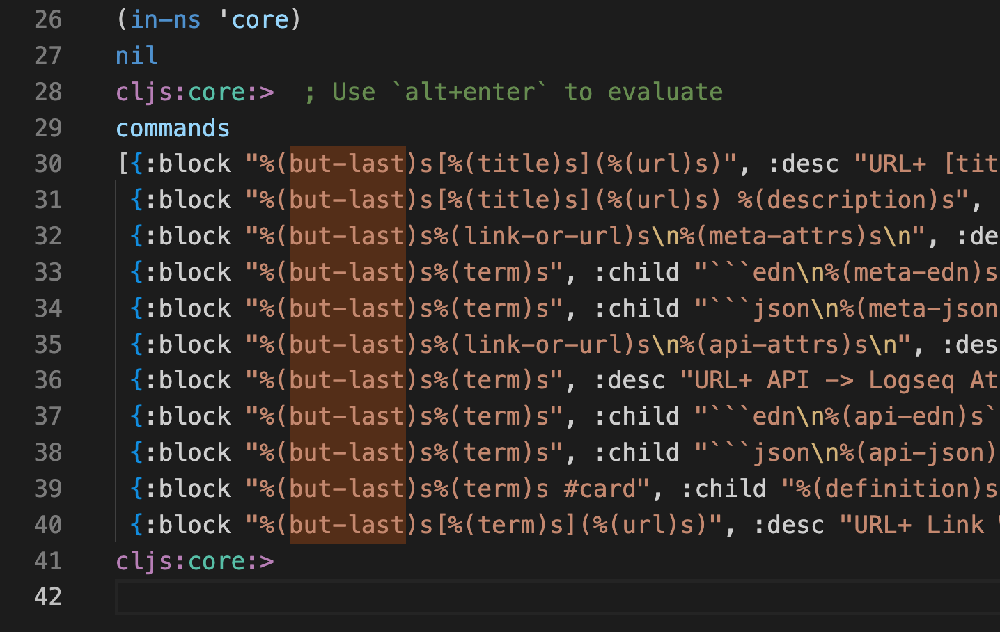
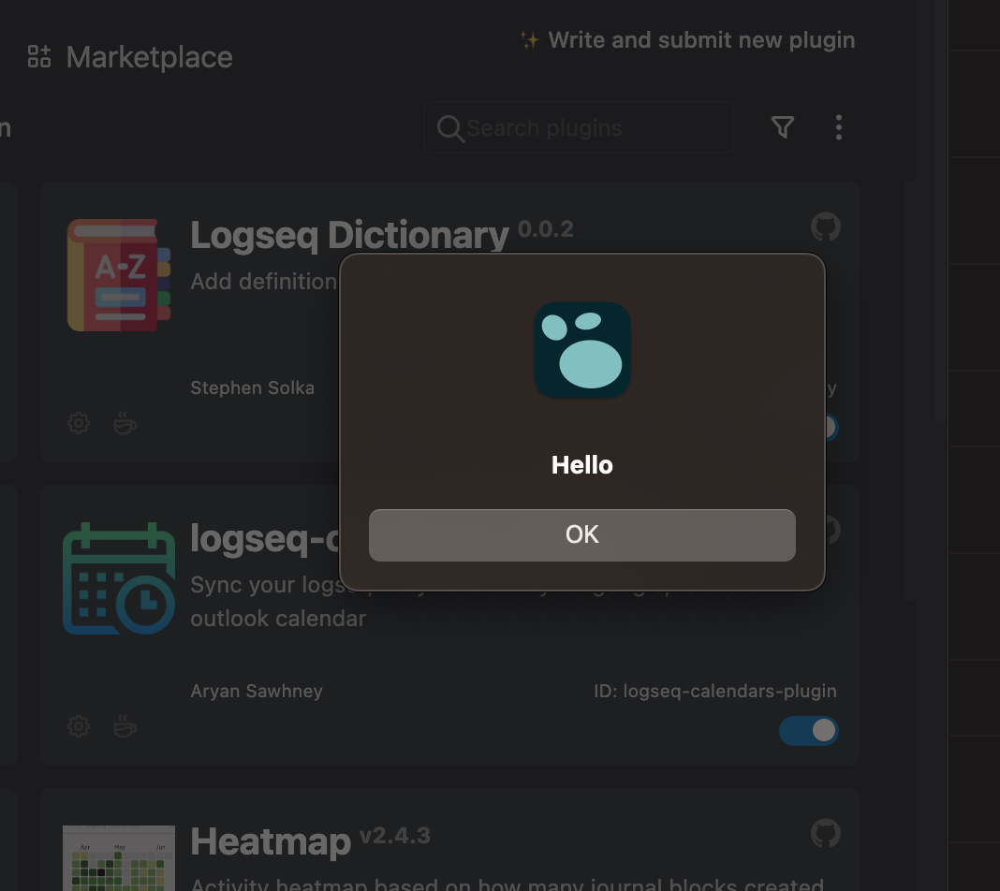
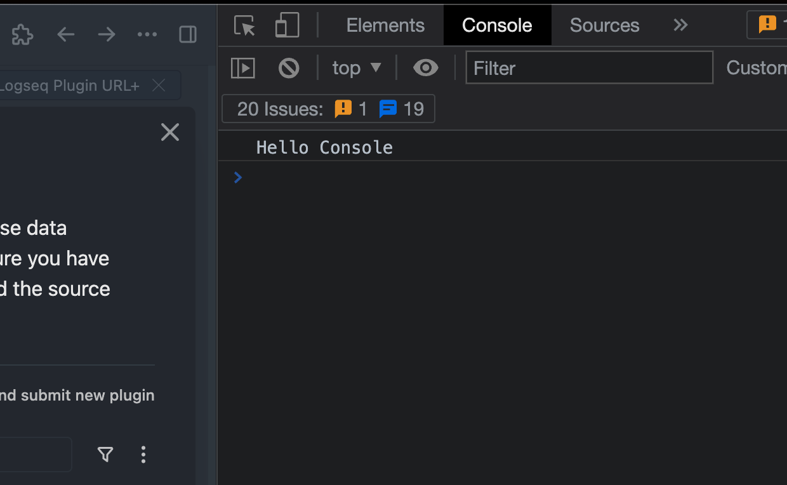

# Logseq Plugin Development in ClojureScript

### General Information

- [Official plugin samples](https://github.com/logseq/logseq-plugin-samples)
- [@logseq/libs](https://logseq.github.io/plugins/)

### Development in ClojureScript

This shadow-cljs project is created by following: https://github.com/thheller/shadow-cljs#quick-start. Notes below:

#### New Project
New project is created from shadow-cljs boilerplate

`npx create-cljs-project logseq-url-plus`
> **NOTE:** This is a onetime operation. Skip if project is already created.

If the codebase is obtained from a git repository, run `yarn install` to install Node.js dependencies

#### shadow-cljs
shadow-cljs setup could be verified by launching the browser REPL

`npx shadow-cljs browser-repl`

On MacOS, a browser will be opened to provide the CLJS runtime. Input `(js/alert "Hello World)` in the REPL and a classic alert box will be shown in the browser window.

In case of Java version related errors, you might want to manage Java with https://github.com/jenv/

#### Development

`yarn dev` 

A few things happen here:
1. Watch code changes and perform compilation if needed
2. Watch and run tests upon unit test code change
> **NOTE:** Current Test Driven Development (TDD) setup runs on Node.js runtime.

See `package.json` scripts section for detail)

In the Logseq App

- Enable developer mode in Logseq
- Click "Load unpacked plugin" and open the ./dist folder
- To open Logseq console for debugging, use Chrome's default hotkey. E.g. `Option Command + i` on MacOS. For more information, see https://www.electronjs.org/docs/latest/tutorial/application-debugging

#### Editor Setup

Atom Editor + Vim mode + Parinfer was my long time preference for Clojure editing. However as Atom is being sunsetting, I've switched to VSCode + Vim + [Paredit](https://calva.io/paredit/) in [Calva](https://calva.io). Took a while to adjust my editing muscle, but the experience is getting greater. 

#### REPL Setup in VSCode

Calva's REPL client is also trivial to connect to the REPL server provided by the shadow-cljs dev mode runtime in Logseq App.
- Make sure Logseq Desktop App developer mode is enabled and `yarn dev` is running as mentioned above
- Uninstall the plugin installed from Marketplace, if applicable
- In Logseq App
  - Select: Plugins -> Load unpacked plugin -> "Choose the plugin project folder"
  - Test the plugin is actually working

Open the plugin project in VSCode. Bring up the command search and follow:

Try evaluate a few forms in the REPL. 

`(in-ns 'core)` switch to namespace `core`

`commands` print the defined commands symbol

`(js/alert "Hello")`

`(js/console.log "Hello Console")`

`(show-msg "Hello Logseq")` Run the defined Clojure fn `show-msg` in namespace `core` to display Logseq App message.

Now the REPL is working cool!

### Marketplace

#### Version Release

- Update the "version" field in `package.json`
- `yarn release`
  It actually runs the script `./scripts/release.sh`, which reads the said "version" field as the git tag to be added. Upon repository pushing to GitHub, the new tag will trigger GitHub workflow to build the assets of a new release.

#### New Marketplace Submission

- Read the [Official Marketplace README](https://github.com/logseq/marketplace/blob/master/README.md)
- Fork `https://github.com/logseq/marketplace`
- Update files in `https://github.com/rlhk/marketplace/tree/master/packages/logseq-url-plus`
- Create pull request (PR)

### TODOs
- [x] Use shadow-cljs advanced compilation in release for release bundle size optimization
- [ ] Move logseq/libs from index.html to ns require when clojure compiler issue is resolved: https://github.com/thheller/shadow-cljs/issues/1061

### Prior Arts and Reference Plugins
- https://github.com/logseq/logseq-plugin-samples (official sample)
- https://github.com/pengx17/logseq-plugin-link-preview
- https://github.com/0x7b1/logseq-plugin-automatic-url-title
- https://github.com/superman66/logseq-plugin-url-md (not recommended by author)
- https://github.com/trashhalo/logseq-dictionary
